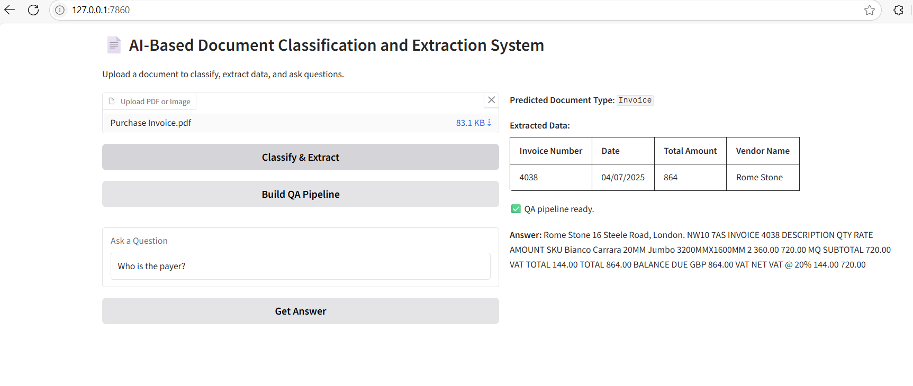
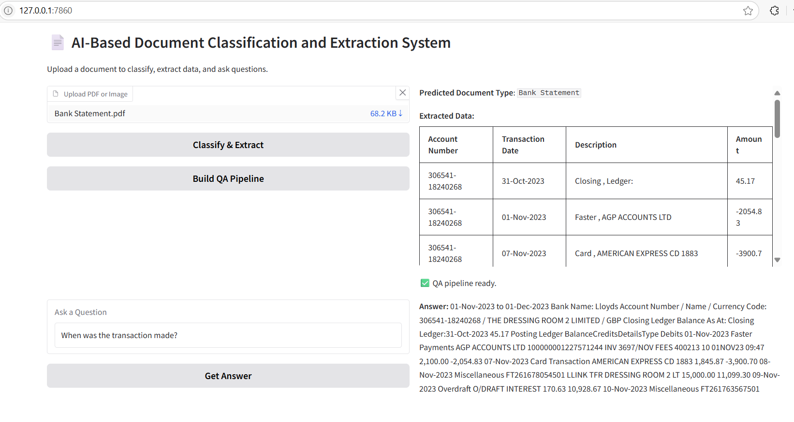
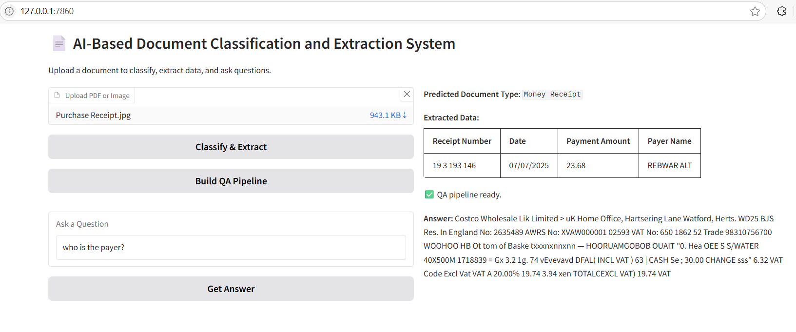
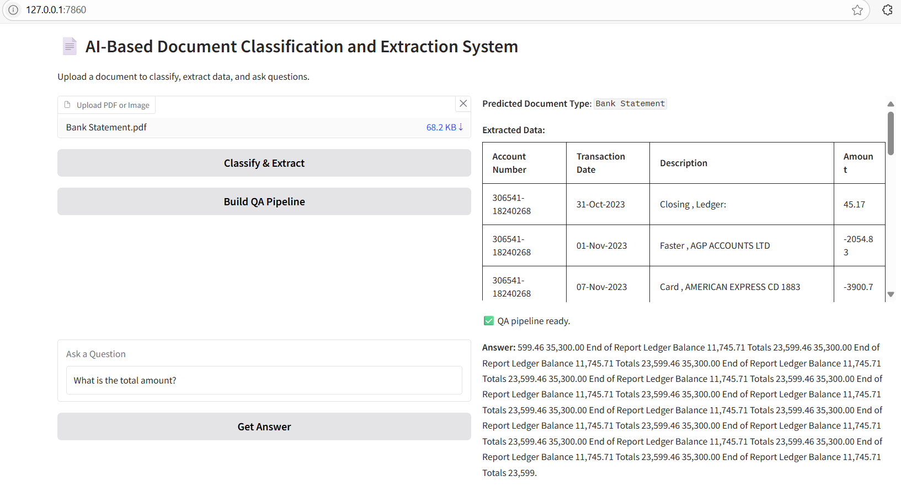

```bash
# 📄 AI-Based Document Classification and Extraction System

## 🚀 Local Setup (Python Virtual Environment)

1. Clone the repository:
   ```bash
   git clone https://github.com/riyad1721/AI-Based-Document-Classification-And-Extraction-System.git
   cd document-ai-app
   ```

2. Create and activate virtual environment:
   ```bash
   # Windows
   python -m venv venv
   venv\Scripts\activate
   
   # Mac/Linux
   python3 -m venv venv
   source venv/bin/activate
   ```

3. Install dependencies:
   ```bash
   pip install -r requirements.txt
   ```

4. Run the application:
   ```bash
   python gradio-app.py
   ```

## 🐳 Docker Setup
```bash
docker build -t document-ai-app .
docker run -p 7860:7860 document-ai-app
```

## 🔧 Environment Configuration
Create `.env` file:
```ini
HF_TOKEN=your_huggingface_token_here
TESSERACT_PATH=C:\Program Files\Tesseract-OCR\tesseract.exe  # Windows example
```

## 🖥️ Web Interface Outputs









## 🌟 Features Demonstrated
✔️ Automatic document classification  
✔️ Structured data extraction  
✔️ Question-Answering capability  
✔️ Clean Gradio interface